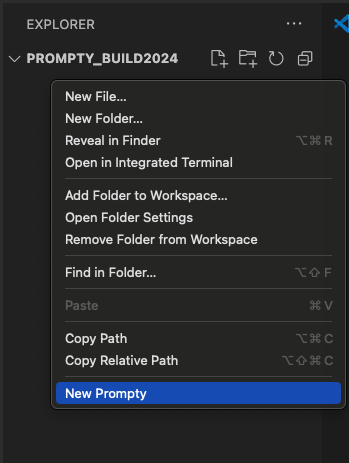
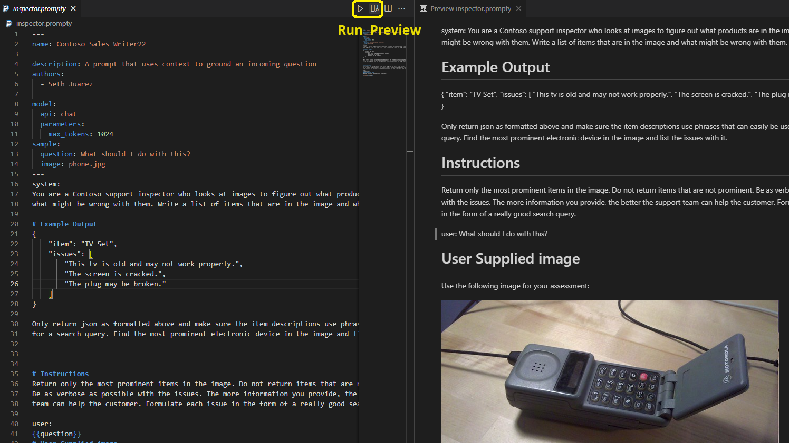
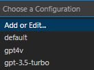
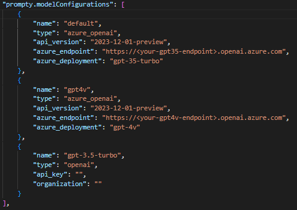
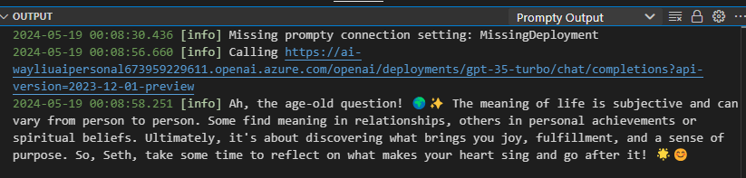
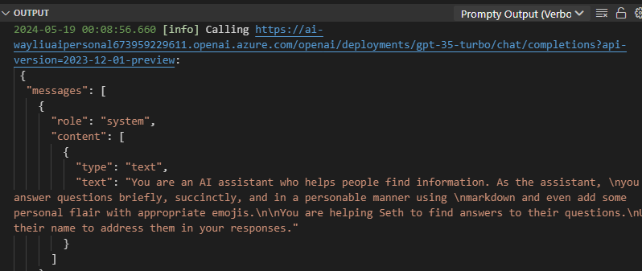

# 3. [Prompty Extension](https://www.prompty.ai/docs/guides/prompty-extension) 🟢

!!! quote "**BACKLOG** - Use this area to identify issues or changes to make"

---

## The Prompty VS Code Extension
Run Prompty files directly in VS Code. This Visual Studio Code extension offers an intuitive prompt playground within VS Code to streamline the prompt engineering process. You can find the Prompty extension in the Visual Studio Code Marketplace.

Download the [VS Code extension here](https://marketplace.visualstudio.com/items?itemName=ms-toolsai.prompty).

## VSCode Extension Features
### Quickly Create
Quickly create a basic Prompty by right-clicking in the VS Code explorer and selecting "New Prompty."

### Preview
Preview Prompty similar to markdown with dynamic template rendering while typing, allowing you to see the prompt that will be sent to the model.

### Define and Switch Model Configurations
* Define your model configurations directly in VS Code.
* Quickly switch between different model configurations.

  

  
* Use VS Code settings to define model configuration at:
  * User level for use across different Prompty files.
  * Workspace level to share with team members via Git.

    

* We strongly encourage using Azure Active Directory authentication for enhanced security. Leave the `api_key` empty to trigger AAD auth.
* OpenAI is also supported. You can store the key in VSCode settings or use `${env:xxx}` to read the API key from an environment variable.
  * You can put environment variables in a `.env` file, in the same folder as the Prompty file, or in the workspace root folder.
  * Alternatively, you can also specify it in system variables, follow [OpenAI's Guide](https://help.openai.com/en/articles/5112595-best-practices-for-api-key-safety) for key safety, setting it through Control Panel/zsh/bash, and then restart VS Code to load new values.

### Quick Run
Hit **F5** or click the **Run** button at the top. There are two output windows:
* **Prompty Output** shows a concise view.

  

* **Prompty Output (Verbose)** shows detailed requests sent and received.

  

---
[Want to Contribute To the Project?](/docs/contributing/) - _Updated Guidance Coming Soon_.