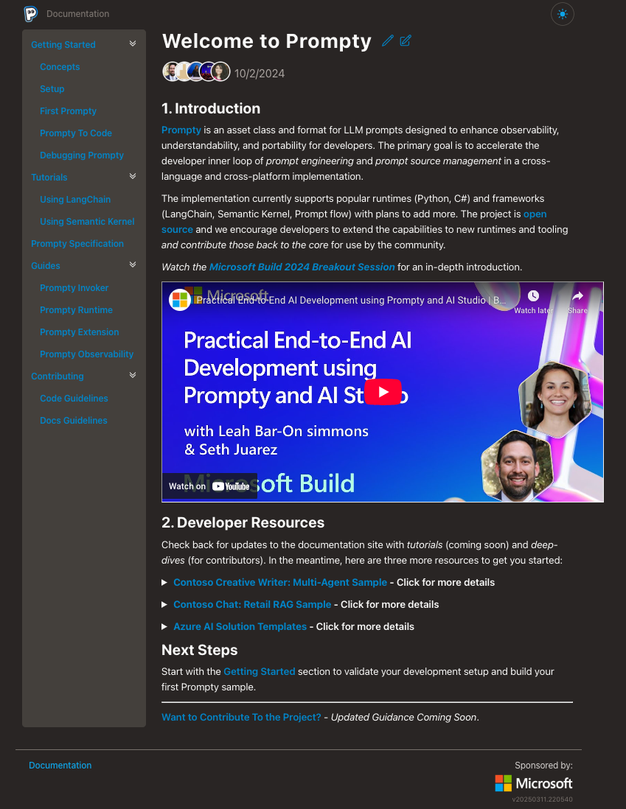

# Objectives

This mkdocs site is a staging area for exploring Prompty documentation ideas before proposing them for merge into the main repository. The staging website uses [mkdocs-material](https://squidfunk.github.io/mkdocs-material/) for convenience. You can learn more about it [under Staging](./Staging/00.md).

The sandbox has 3 objectives:

1. Track Prompty documentation (main) change requests and updates
1. Provide a [searchable](.//Prompty%20/00.md) version of docs for quick reviews of proposed fixes
1. Provide a [sandbox](./Sandbox/00.md) for exploring new ideas like cookbooks and samples

----

!!! info "Prompty Docs - Mar 14 Screenshot"

    