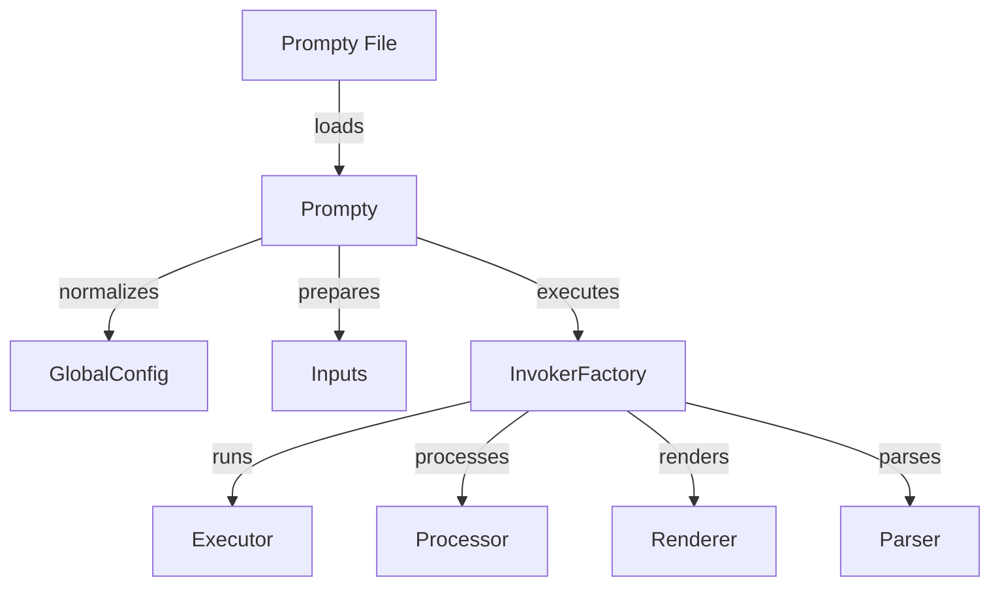

# 2. [Prompty Runtime](https://www.prompty.ai/docs/guides/prompty-runtime) 

## What Is It?

The Prompty Runtime is a framework designed to execute Prompty assets, which are standardized prompt definitions for Large Language Models (LLMs). It provides **a structured way to load, prepare, and execute these prompts**, ensuring that the necessary configurations and inputs are correctly handled. The runtime supports various programming languages (Python, C# etc.) and frameworks (LangChain, Semantic Kernel etc.), making it versatile for different development environments. 

In essence, **the Prompty Runtime transforms static Prompty files into executable code**. It handles the lifecycle of a prompt, from loading the file and normalizing configurations to preparing inputs and invoking the model. This process allows developers to seamlessly integrate prompt execution into their applications, enabling rapid prototyping, testing, and deployment of LLM-based solutions.

## How Is It Built?

The diagram below represents the components in the _Python_ runtime, giving you a sense of how the Prompty asset is processed and executed. At a high level, we can see the execution flow as three main steps:

1. **Loading** - where the Prompty file is loaded and initialized in the system.
1. **Preparing** - where configuration paramers are normalized and inputs validated.
1. **Execution** - where the prompt template is rendered and model invoked with it.

## How Does It Work?

1. **Prompty File**: The Prompty file is the starting point. It contains the prompt definition, including metadata, inputs, and the template.

2. **Prompty**: The Prompty class is responsible for loading the Prompty file. It reads the file content and initializes the Prompty object.

3. **GlobalConfig**: The Prompty object normalizes the configuration by merging global settings with the specific settings defined in the Prompty file.

4. **Inputs**: The Prompty object prepares the inputs by validating and merging them with sample data if provided.

5. **InvokerFactory**: The InvokerFactory is responsible for executing the prepared prompt. It determines the appropriate invoker (Executor, Processor, Renderer, or Parser) based on the configuration.

6. **Executor**: The Executor runs the prompt against the specified model, generating the initial response.

7. **Processor**: The Processor processes the raw response from the Executor, applying any necessary transformations or post-processing steps.

8. **Renderer**: The Renderer formats the processed response into the desired output format, such as Markdown or JSON.

9. **Parser**: The Parser parses the rendered output, extracting relevant information or converting it into a structured format.

## Adding a New Runtime

To add support for a new runtime (e.g., JavaScript or Java), follow these high-level steps:

- **Define the Runtime Class**: Create a new class that implements the necessary methods to load, prepare, and execute Prompty files. Ensure this class adheres to the interface expected by the Prompty framework. Refer to `PromptyPythonRuntime` in `/workspaces/prompty/runtime/prompty-python/PromptyPythonRuntime.py` for an example.

- **Implement the Loading Logic**: In the new runtime class, implement the logic to load Prompty files. This involves reading the file content and initializing the runtime-specific objects. Refer to the `load` method in `PromptyPythonRuntime` for an example.

- **Normalize Configuration**: Implement the method to normalize configuration parameters. Merge global settings with the specific settings defined in the Prompty file. Refer to the `normalize_config` method in `PromptyPythonRuntime` for an example.

- **Prepare Inputs**: Implement the method to validate and prepare inputs. Merge inputs with sample data if provided. Refer to the `prepare_inputs` method in `PromptyPythonRuntime` for an example.

- **Create Invoker Factory**: Implement an invoker factory that determines the appropriate invoker (Executor, Processor, Renderer, or Parser) based on the configuration. Refer to the `InvokerFactory` class in `PromptyPythonRuntime` for an example.

- **Implement Executors and Processors**: Create classes for Executor, Processor, Renderer, and Parser. Ensure these classes handle the specific logic for executing the prompt, processing the response, rendering the output, and parsing the results. Refer to the `Executor`, `Processor`, `Renderer`, and `Parser` classes in `PromptyPythonRuntime` for examples.

- **Integrate with Prompty Framework**: Register the new runtime with the Prompty framework. Ensure the framework can recognize and utilize the new runtime for executing Prompty files. Refer to the registration process in `PromptyPythonRuntime` for an example.

- **Testing**: Write unit tests and integration tests to ensure the new runtime works correctly. Validate that the runtime can handle various Prompty files and configurations. Refer to the test cases in `/workspaces/prompty/tests` for examples.

By following these steps, you can extend the Prompty framework to support additional runtimes, enabling more flexibility and integration with different programming environments.

---