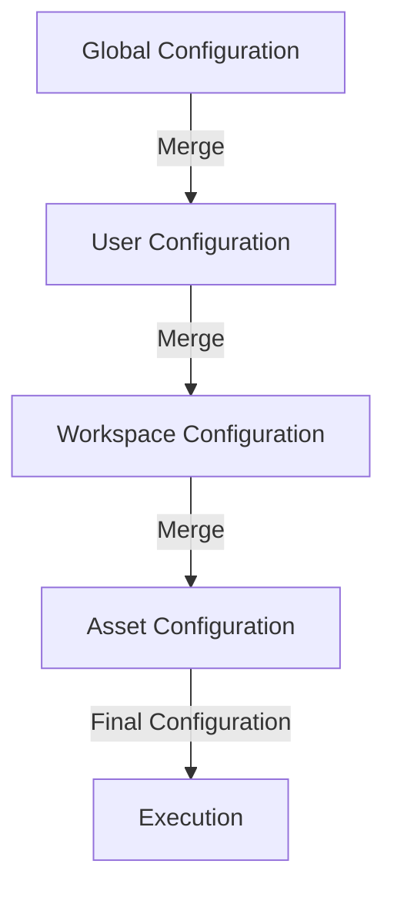

# [Guides](https://www.prompty.ai/docs/guides) 

## Introduction to the Prompty Codebase

The Prompty codebase is designed to provide a comprehensive framework for creating, managing, and executing prompt-based interactions with Large Language Models (LLMs). It is structured to support a wide range of development workflows, from rapid prototyping to production deployment. Below, we outline the key components and concepts that make up the Prompty codebase.

---

### Codebase Structure

The Prompty codebase is organized into two top-level regions:

- **runtime/**: Runtime implementations for core languages (e.g., Python, C#).
- **web/**: Houses the documentation site and related assets.

This is the listing of the `prompty/prompty` folder for the Python runtime:

```bash
runtime/prompty/prompty
├── __init__.py
├── cli.py
├── core.py
├── invoker.py
├── parsers.py
├── renderers.py
├── tracer.py
├── utils.py
├── azure/
│   ├── __init__.py
│   ├── executor.py
│   └── processor.py
├── openai/
│   ├── __init__.py
│   ├── executor.py
│   └── processor.py
└── serverless/
    ├── __init__.py
    ├── executor.py
    └── processor.py
```

Let's take a quick look at what each of these files and folders represent:

- `__init__.py`: Initializes the Prompty package and imports key modules.
- `cli.py`: Contains the command-line interface for running Prompty.
- `core.py`: Core functionalities and utilities for prompt execution.
- `invoker.py`: Manages the execution of different types of prompts.
- `parsers.py`: Includes parsers for interpreting and converting prompt inputs.
- `renderers.py`: Manages the visual representation of prompt outputs.
- `tracer.py`: Provides tracing capabilities for logging and debugging.
- `utils.py`: Utility functions used across the Prompty package.
- `azure/`: Contains modules specific to Azure invokers.
  - `__init__.py`: Initializes the Azure invoker package.
  - `executor.py`: Manages the execution of prompts using Azure services.
  - `processor.py`: Processes the results from Azure services.
- `openai/`: Contains modules specific to OpenAI invokers.
  - `__init__.py`: Initializes the OpenAI invoker package.
  - `executor.py`: Manages the execution of prompts using OpenAI services.
  - `processor.py`: Processes the results from OpenAI services.
- `serverless/`: Contains modules specific to serverless invokers.
  - `__init__.py`: Initializes the serverless invoker package.
  - `executor.py`: Manages the execution of prompts using serverless services.
  - `processor.py`: Processes the results from serverless services.

---

### Key Concepts

Here are a few key concepts to know in Prompty:

- **Prompty Runtime**: The engine that loads, prepares, and executes Prompty assets. It ensures that the necessary configurations and inputs are correctly handled, making it possible to integrate prompt execution seamlessly into applications.

- **Prompty Invoker**: Responsible for executing the prepared prompt. It determines the appropriate invoker (Executor, Processor, Renderer, or Parser) based on the configuration, ensuring that the prompt is processed and rendered correctly.

  - **Prompty Executor**: Executes the prompt against the specified model, generating the initial response.

  - **Prompty Processor**: Processes the raw response from the Executor, applying any necessary transformations or post-processing steps.

  - **Prompty Renderer**: Formats the processed response into the desired output format, such as Markdown or JSON.

  - **Prompty Parser**: Interprets and converts prompt inputs into executable formats.


- **Prompty Observability**: Allows developers to monitor and debug the execution of Prompty assets. It provides insights into the execution flow, helping identify and resolve issues efficiently.

  - **Prompty Tracer**: A tool for logging and visualizing the execution of Prompty assets. It captures detailed trace information, which can be used to analyze and debug the prompt execution process.

- **Prompty Asset**: A standardized file format that encapsulates the prompt definition, including metadata, inputs, and the template. It unifies the prompt content and its execution context in a single asset package.

  - **Prompty Configuration**: The settings and parameters that define how a Prompty asset should be executed. This includes model configurations, input parameters, and other execution settings.

  - **Parameter Hoisting**: A mechanism in Prompty that allows for the merging of global and local configurations. It ensures that the most specific configuration settings are applied during prompt execution, providing flexibility and control over the prompt behavior.

  - **Prompty Sample**: Example inputs provided in the Prompty asset to demonstrate how the prompt should be executed.

  - **Prompty Template**: The content of the prompt, which includes the structure and format of the prompt that will be sent to the model.


- **Prompty CLI**: Command-line interface for running Prompty, allowing users to execute prompts from the terminal.

- **Prompty Extensions**: Additional modules or plugins that extend the functionality of Prompty, such as support for new models or integration with other tools.

---

## Asset Configuration

Asset configuration in Prompty refers to the process of defining how a Prompty asset should be executed. This includes specifying model configurations, input parameters, and other execution settings. The configuration ensures that the necessary settings are applied to the prompt execution, providing flexibility and control over the prompt behavior.

### Parameter Hoisting

Parameter hoisting is a mechanism in Prompty that allows for the merging of global and local configurations. It ensures that the most specific configuration settings are applied during prompt execution. This process involves combining configurations from different levels (e.g., global, user, workspace, and asset) to determine the final configuration used for execution.

#### Parameter Hoisting Diagram



### Usage Scenarios

#### Scenario 1: Default Configuration

In this scenario, only the global configuration is defined. The final configuration will use the global settings.

```yaml
# Global Configuration
model:
  api: chat
  configuration:
    type: openai
    name: gpt-3
    organization: my-org
  parameters:
    max_tokens: 1000
```

**Final Configuration:**

```yaml
model:
  api: chat
  configuration:
    type: openai
    name: gpt-3
    organization: my-org
  parameters:
    max_tokens: 1000
```

#### Scenario 2: User Configuration Override

In this scenario, the user configuration overrides some of the global settings.

```yaml
# User Configuration
model:
  configuration:
    name: gpt-4
  parameters:
    max_tokens: 2000
```

**Final Configuration:**

```yaml
model:
  api: chat
  configuration:
    type: openai
    name: gpt-4
    organization: my-org
  parameters:
    max_tokens: 2000
```

#### Scenario 3: Workspace Configuration Override

In this scenario, the workspace configuration overrides some of the user settings.

```yaml
# Workspace Configuration
model:
  configuration:
    organization: new-org
  parameters:
    max_tokens: 1500
```

**Final Configuration:**

```yaml
model:
  api: chat
  configuration:
    type: openai
    name: gpt-4
    organization: new-org
  parameters:
    max_tokens: 1500
```

#### Scenario 4: Asset Configuration Override

In this scenario, the asset configuration overrides some of the workspace settings.

```yaml
# Asset Configuration
model:
  parameters:
    max_tokens: 3000
```

**Final Configuration:**

```yaml
model:
  api: chat
  configuration:
    type: openai
    name: gpt-4
    organization: new-org
  parameters:
    max_tokens: 3000
```

---