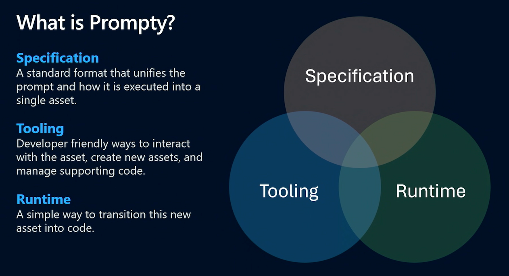
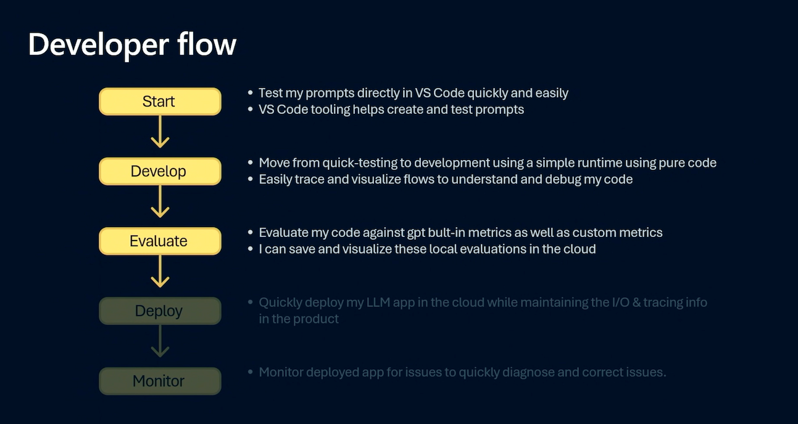
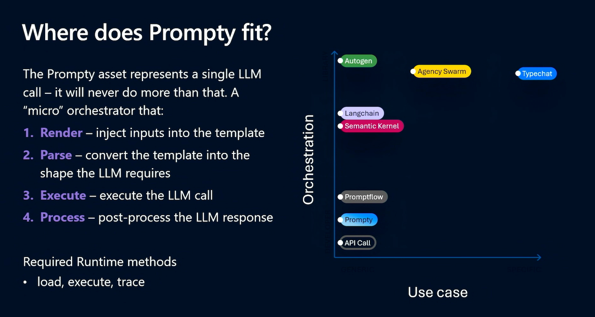
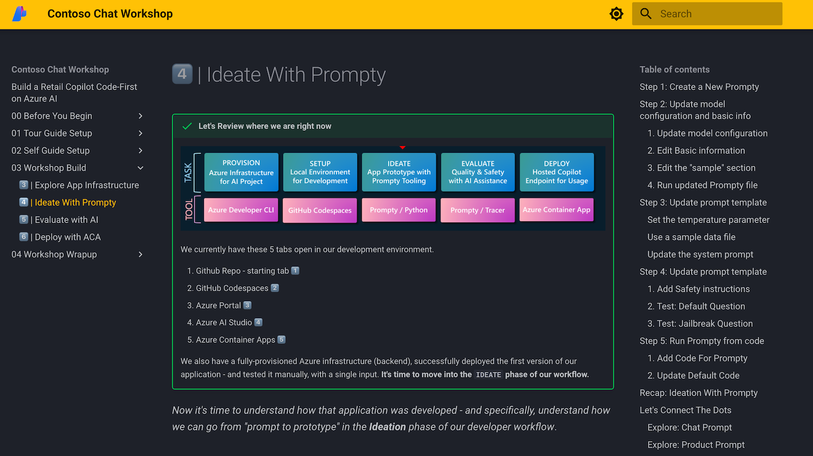
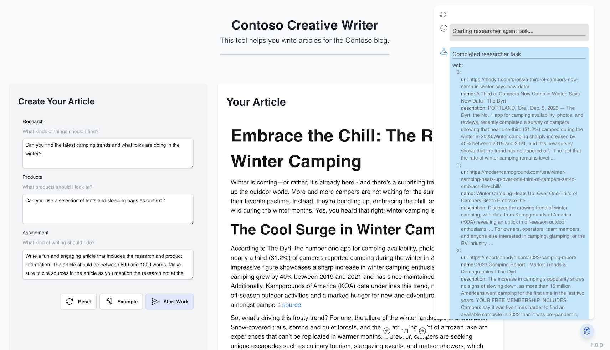
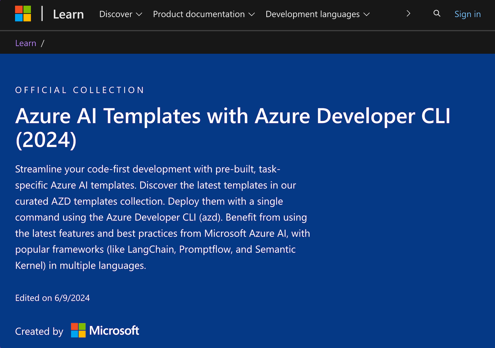

# Introduction

!!! example "Learning Resources For Developers"

    - [Read the documentation](https://prompty.ai/docs)
    - [Watch the video](https://www.youtube.com/watch?v=HALMFU7o9Gc)
    - [Explore the repo](https://github.com/microsoft/prompty)

## What is Prompty?

Prompty is a new asset class and format for LLM prompts that aims to provide observability, understandability, and portability for developers. It consists of three main components: 

- the **Prompty Specification** - a format that describes the asset.
- the **Prompty Tools** - developer workflows to create & manage assets.
- the **Prompty Runtime** - convert asset to code, for testing & usage.

## How do we use Prompty?

Prompty is ideal for rapid prototyping and iteration of a new generative AI application, using rich developer tooling and a local development runtime.

- **Start** by creating & testing a simple prompt in VS Code
- **Develop** by iterating config & content, use tracing to debug
- **Evaluate** prompts with AI assistance, saved locally or to cloud

## Where do we use Prompty?

There are many tools & frameworks for building generative AI solutions today. So where does Prompty fit? Think of it as a **micro-orchestrator for a single LLM invocation** where you can:

1. _configure_ a specific model for your needs
1. _create_ the template content (system, user, context, instructions)
1. _shape_ the data used to "render" template for a real invocation

The Prompty tools and runtime can convert the asset into _code_ that can then be used with richer frameworks (like Semantic Kernel, LangChain, Prompt flow and more) to **orchestrate more complex workflows** for your application.

## Prompty For Developers

### 1. Deep Dive: MSBuild Session

Watch this replay from the Microsoft Build 2024 conference to learn how Prompty works, and how it can streamline your AI development journey from prompt to production. 

<iframe width="800" height="400" src="https://www.youtube.com/embed/HALMFU7o9Gc" title="BRK114:Practical End-to-End AI Development using Prompty and AI Studio" frameborder="0" allowfullscreen></iframe>

You can find a [transcript of the session here](https://build.microsoft.com/sessions/86e41e8b-1fd2-40fa-a608-6f99a28d4a61?source=sessions). Save the file to your local device, open it in VS Code - then try using Copilot Chat to get a summary of the main points:

!!! tip "This is the summarization prompt I used"

    Summarize the transcript and generate a blog in Markdown format with the following components:

    Divide the summary into 6 topics with each topic described in a Markdown section
    The section should have a descriptive title followed by a short paragraph describing the topic, followed by a list of 4 bullet points that summarize what you learned in that section.
    Start the Markdown document with a brief description of the whole document and 4 bullet items about what the entire summary covers

??? example "This is the lightly-edited output of that prompt for reference"

    This document provides a summary of the BRK114 session held at Microsoft Build 2024. The session, led by Seth Juarez and Leah Bar On Simmons, covers various aspects of AI development using Prompty and AI Studio. Below are the key topics discussed:

    - Overview of the Session
    - Introduction to Prompty and AI Studio
    - Getting Started with LLMs
    - Prompty Specification
    - Developing an App with Prompty
    - Seth Juarez's Perspective on LLMs

    #### 1.1 Session Overview

    The session, BRK114, is part of the Microsoft Build 2024 event and is presented by Seth Juarez and Leah Bar On Simmons. It focuses on practical end-to-end AI development using Prompty and AI Studio.

    - **Speakers**: Seth Juarez, Leah Bar On Simmons
    - **Event**: Microsoft Build 2024
    - **Session Focus**: Practical AI development
    - **Audience Interaction**: Encouraged feedback and questions

    #### 1.2 Prompty and AI Studio

    Seth Juarez introduces Prompty and AI Studio, highlighting their importance in AI development. He emphasizes the practical applications and the fun elements like logos, stickers, and merchandise.

    - **Tools Introduced**: Prompty, AI Studio
    - **Session Tone**: Interactive and engaging
    - **Merchandise**: Stickers, T-shirts, hats
    - **Audience Engagement**: Encouraged to ask questions

    #### 1.3 Getting Started

    The session covers the basics of getting started with Large Language Models (LLMs) using Prompty in Visual Studio Code. Seth Juarez explains the initial steps and the importance of understanding the Prompty specification.

    - **Focus**: Getting started with LLMs
    - **Tool**: Visual Studio Code
    - **Specification**: Prompty spec
    - **Initial Steps**: Explained by Seth Juarez

    #### 1.4 Prompty Specification

    Seth Juarez delves into the Prompty specification, explaining its significance and how it guides the development process. He emphasizes the structured approach provided by the specification.

    - **Specification**: Prompty spec
    - **Importance**: Guides development
    - **Structure**: Provides a structured approach
    - **Explanation**: Detailed by Seth Juarez

    #### 1.5 Develop AI Apps

    The session includes a segment on developing an application using Prompty. Seth Juarez walks through the process, highlighting key aspects and best practices.

    - **Focus**: App development with Prompty
    - **Process**: Walkthrough by Seth Juarez
    - **Key Aspects**: Highlighted during the session
    - **Best Practices**: Discussed

    #### 1.6 Seth LLM Perspective 

    Seth Juarez shares his unique perspective on Large Language Models, likening them to giant language calculators. He uses relatable examples to explain his viewpoint.

    - **Perspective**: LLMs as language calculators
    - **Examples**: Relatable and engaging
    - **Explanation Style**: Unique and insightful
    - **Audience Engagement**: Encouraged to follow along

    This summary captures the essence of the BRK114 session, providing a structured overview of the key topics discussed by Seth Juarez and Leah Bar On Simmons at Microsoft Build 2024.

### 2. Hands-On Samples

#### 2.1 Contoso Chat (RAG)
Learn how to use Prompty to rapidly prototype a RAG-based retail copilot, from prompt engineering to evaluation and deployment, using the [Contoso Chat sample](https://aka.ms/aitour/contoso-chat). **Click the image below to visit an interactive workshop guide**.

#### 2.2. Creative Writer (Agentic)

Learn how to use Prompty to build a rapid prototype for a multi-agent AI solution, integrating search and content creation, using the [Contoso Creative Writer sample](https://github.com/Azure-Samples/contoso-creative-writer). **Visit the repo for a link to an interactive workshop guide.**

#### 2.3. AI Templates (AZD)

Want to explore more Azure AI application samples built with prompty? Check out the [2024 AI Templates collection](https://learn.microsoft.com/collections/5pq0uompdgje8d?sharingId=ADFFF9D4AD9A0F29&WT_mc.id=aip-114567-cassieb) released at Microsoft Build 2024 for early samples using diverse programming languages, frameworks, and deployment targets.

